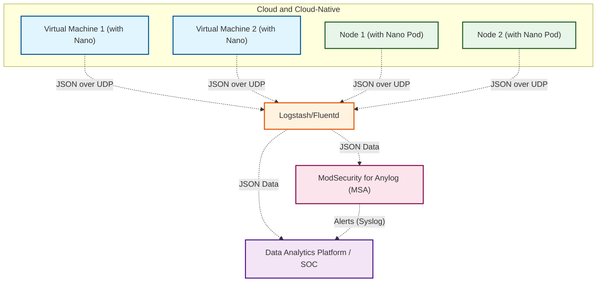

# ModSecurity for Anylog


## 🎬Background

In cloud and cloud-native environments, how to achieve application-level lateral movement attack detection, and sensitive data abnormal behavior warning, without affecting the environment and business, without blind spots, is two difficulties in the industry; 


## 🛠Resolvent

ModSecurity is a famous WAF engine, but the original version of ModSecurity can only detect Raw Packet, which is usually only used for traditional architecture and cloud boundary security; 

Nano Probe can obtain fine-grained traffic logs inside cloud and cloud-native environments in an ultra-lightweight way; 

If we modify ModSecurity to analyze the HTTP fine-grained logs output by Nano, we can, in principle, fully leverage ModSecurity's  detection capabilities to detect various application-level lateral movement attacks and sensitive data behavior anomalies within the cloud and cloud-native environments. 


## 📠MSA Introduction

ModSecurity for Anylog (hereinafter referred to as **MSA**) is based on the above background and method. 

It is a modified version of ModSecurity for all application logs. It can not only analyze JSON logs from Nano probes, but also enable attack detection on any application and business logs through user configuration. 


**lateral movement attack detection architecture **



## 🤷‍♂️How to Use？


Clone the code

```bash
[root@racknerd-b20bda0 ~]# git clone https://github.com/Microflow-IO/modsecurity-for-anylog
Cloning into 'modsecurity-for-anylog'...
remote: Enumerating objects: 66, done.
remote: Counting objects: 100% (66/66), done.
remote: Compressing objects: 100% (49/49), done.
remote: Total 66 (delta 15), reused 63 (delta 15), pack-reused 0 (from 0)
Unpacking objects: 100% (66/66), done.
```

Modify the LISTEN_PORT and OUTPUT environment variables according to your situation. Here, LISTEN_PORT is the JSON port for GELF format input, and OUTPUT is the JSON output port for alerts, both carried over UDP.

```bash
[root@racknerd-b20bda0 ~]# cd modsecurity-for-anylog/
[root@racknerd-b20bda0 modsecurity-for-anylog]# ls
docker-compose.yml  LICENSE  modsecurity
[root@racknerd-b20bda0 modsecurity-for-anylog]# cat docker-compose.yml | grep env -A 4
    environment:
      LISTEN_PORT: 15155
      OUTPUT: 127.0.0.1:12201
      RULEPATH: /usr/local/openresty/nginx/conf/modsecurity/modsecurity.conf
```

Use docker compose up -d to start the container

```bash
[root@racknerd-b20bda0 modsecurity-for-anylog]# docker compose up -d
[+] Running 2/2
 ✔ Network modsecurity-for-anylog_default  Created                                   0.3s 
 ✔ Container uniwaf                        Started                                   0.4s 
[root@racknerd-b20bda0 modsecurity-for-anylog]# docker ps | grep uniwaf
82a5bbb5f1ee   registry.jxit.net.cn:5000/uniserver/uniwaf:git-25     "sh -xc 'uniwaf -a -…"   12 seconds ago   Up 11 seconds                                               uniwaf
```

modsecurity directory stores alert rule files and maps to /usr/local/openresty/nginx/conf/modsecurity/ in the container.

```bash
[root@racknerd-b20bda0 modsecurity-for-anylog]# ls modsecurity/
crs-setup.conf  makefile.test  modsecurity.conf  rules  unicode.mapping  
[root@racknerd-b20bda0 modsecurity-for-anylog]# ls modsecurity/rules/
crawlers-user-agents.data                        REQUEST-931-APPLICATION-ATTACK-RFI.conf
iis-errors.data                                  REQUEST-932-APPLICATION-ATTACK-RCE.conf
```

You can modify rule files in modsecurity/rules, restart the container for changes

```bash
[root@racknerd-b20bda0 modsecurity-for-anylog]# docker compose restart
[+] Restarting 1/1
 ✔ Container uniwaf  Started                                               10.5s
```

Enter container check test data and script, sending test-uniwaf.json to port 15155 once per second

```bash
[root@racknerd-b20bda0 ~]# docker exec -it uniwaf sh
/ # cd /usr/local/openresty/nginx/conf/modsecurity/
/usr/local/openresty/nginx/conf/modsecurity # ls
test.sh            uniwaf-proxy.conf test-uniwaf.json   unicode.mapping
/usr/local/openresty/nginx/conf/modsecurity # cat test-uniwaf.json 
{"BEGIN_TIME":"2024-05-30 07:16:48.917","END_TIME":"2024-05-30 07:16:48.918","PROBE_VER":"20240527-128","host":"10.64.1.254","SYSTEM":"Ubuntu 22.04.3","SRC_IP":"192.168.1.105","DST_IP":"192.168.1.55","SRC_PORT":"46152","DST_PORT":"80","NIC":"any","CARD":"br-vmr","CARD_IP":"192.168.1.105","SRC_NET_DELAY":"0.01","DST_NET_DELAY":"0.13","NET_DELAY":"0.14","RST_PKTS":"0","RETRANS_PKTS":"0","BYTES":"1171","HTTP_RESPONSE":"0.792","PAGELOAD":"0.792","RETCODE":"403","METHOD":"GET","URL":"/?t=../../etc/passwd","DOMAIN":"192.168.1.55","FORWARD":"0.0.0.0","AGENT":"curl/7.81.0","REQ_HEADER":"GET /?t=../../etc/passwd HTTP/1.1\r\nHost: 192.168.1.55\r\nUser-Agent: curl/7.81.0\r\nAccept: */*\r\n\r\n","REQ_BODY":"","RSP_HEADER":"HTTP/1.1 403 Forbidden\r\nDate: Thu, 30 May 2024 07:16:49 GMT\r\nContent-Type: text/html; charset=UTF-8\r\nTransfer-Encoding: chunked\r\nConnection: keep-alive\r\nserver: ZhongKui WAF\r\n\r\n","RSP_BODY":"223sdfalkjsflkajf","L7_PROTOCOL":"http","L4_PROTOCOL":"tcp","message":"jxit","message-type":"comm","gl2_source_collector":"64210464315174928","DISK_RATIO":"46.73","TOTAL_CPU":"4","LICENSE":"Only for POC"}
/usr/local/openresty/nginx/conf/modsecurity # cat test.sh 
#!/bin/sh

while true; do 
  timeout 1 nc -u 127.0.0.1 15155 < test-uniwaf.json 
  sleep 1
done
```

Start the script and use tcpdump to grab the 12201 alarm output port packet

```bash
/usr/local/openresty/nginx/conf/modsecurity # nohup ./test.sh &
/usr/local/openresty/nginx/conf/modsecurity # nohup: appending output to nohup.out
/usr/local/openresty/nginx/conf/modsecurity # 
/usr/local/openresty/nginx/conf/modsecurity # timeout 5 tcpdump -i lo port 12201 -w a.pcap
tcpdump: listening on lo, link-type EN10MB (Ethernet), snapshot length 262144 bytes
2 packets captured
6 packets received by filter
```

Open the packet file to verify the alarm generated by the attack

```bash
/usr/local/openresty/nginx/conf/modsecurity # cat a.pcap 
{"rule_id":"932160","alert_engine":"modsecurity","time":"2024-05-30 07:16:48","message":"jxit","forward":"0.0.0.0","retcode":"403","source":"","src_ip":"192.168.1.105","dst_ip":"192.168.1.55","geoip":"","src_port":"46152","dst_port":"80","host":"10.64.1.254","domain":"192.168.1.55","url":"/?t=../../etc/passwd","method":"GET","msg":"Remote command execution: Discover Unix Shell code","matched":"Matched \"Operator `PmFromFile' with parameter `unix-shell.data' against variable `ARGS:t' (Value: `../../etc/passwd' )","severity":"2","req_header":"GET /?t=../../etc/passwd HTTP/1.1\r\nHost: 192.168.1.55\r\nUser-Agent: curl/7.81.0\r\nAccept: */*\r\n\r\n","req_body":"","rsp_header":"HTTP/1.1 403 Forbidden\r\nDate: Thu, 30 May 2024 07:16:49 GMT\r\nContent-Type: text/html; charset=UTF-8\r\nTransfer-Encoding: chunked\r\nConnection: keep-alive\r\nserver: ZhongKui WAF\r\n\r\n","rsp_body":"223sdfalkjsflkajf"}
```

